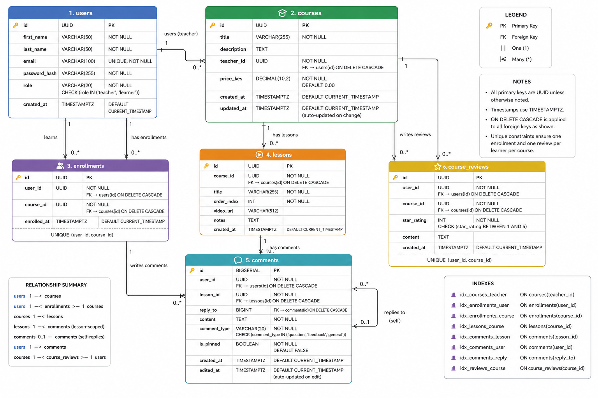

# TradeLearn

A comprehensive, multi-role eLearning platform designed to make trading content accessible, interactive, and structured. This platform connects knowledge-sharers (Teachers) with active learners (Students) through tiered course access, interactive quizzes, automated progress tracking, and a unified communication system.

---

## 👥 User Roles

The platform is designed around two primary user personas, with foundational planning for future administrative governance.

### 1. Teacher

Content creators who publish trading courses, manage pricing structures, and engage directly with their student base.

- **Course Management:** Create, update, and delete rich multi-media courses consisting of text, images, and videos.
- **Monetization & Tiering:** Set standard course pricing, run promotional discount periods, and manage tiered content access thresholds.
- **Student Engagement:** Send individual or broadcast announcements, host interactive Q&A or live sessions, and deploy assessments.
- **Performance Dashboards:** Track analytics regarding active enrollments, course completion rates, traffic trends, and aggregate revenue generation.

### 2. Learner / Student

End-users looking to acquire trading skills through structured material, interactive evaluation, and community support.

- **Structured Learning:** Securely browse, purchase, and access course content while maintaining granular progress tracking.
- **Assessment & Certification:** Test comprehension via modular quizzes and automatically earn certificates upon full course completion.
- **Knowledge Base & Community:** Interact with teachers and peers through a unified comment and feedback layer.

_(Optional: Admin role reserved for future consideration regarding platform-wide moderation and infrastructure oversight)._

---

## 🛠️ Functional Specifications

### A. Teacher Workflow & Capabilities

- **Input Operations:**
  - Secure account registration and authenticated login.
  - Full CRUD lifecycle control over courses and structural lessons.
  - Pricing controls and tiered subscription parameters:
    - _6 Months Access:_ Base material.
    - _1 Year Access:_ Includes full quiz suite integration.
    - _Infinite Access:_ Full quiz access plus interactive live sessions (utilizing Google Links and access codes).
  - Promotional engine to schedule flash sales and discount windows.
  - Granular user access management per course.
  - Direct messaging infrastructure (1:1 personal messaging or bulk broadcast updates to all enrolled students).
  - Interactive social mechanisms: Post comments, reply to threads, like student input, and pin high-value discussions.
  - Quiz builder for module evaluations.
- **Output Profiles:**
  - Real-time analytics tracking active enrollments, current progress milestones, and course completion figures.
  - Financial analytics dashboard reporting raw and aggregate revenue.
  - Centralized review feed tracking student feedback, questions, and star ratings across all managed courses.
- **Data & Storage Profile:**
  - Secure profile metadata (credentials, biographical info, preferences).
  - Optimized asset storage mappings for uploaded videos, documentation, text, and graphics.
  - Granular performance metrics tracking user traffic and revenue analytics.

### B. Learner Workflow & Capabilities

- **Input Operations:**
  - Streamlined authentication (supporting Email/Password and social single sign-on like Google Auth).
  - Secure financial onboarding for managing payment credentials.
  - Interactive communication panels to submit multi-purpose comments (Questions, Feedback, General, Reviews).
  - Engagement tools to like and reply to relevant threads or community boards.
  - Personal scratchpad / note-taking utility associated with lessons (optional target).
  - Interactive interface for attempting module quizzes.
- **Output Profiles:**
  - Dynamic media rendering engine for viewing text, image, and video content based on active entitlement level.
  - Visual progress tracker charting course advancement milestones.
  - Context-aware comment feeds showing historical threads, public Q&As, and direct replies from instructors.
  - Immediate quiz feedback showing performance metrics and historical scores.
  - Automated certificate generation engine upon 100% video/content compliance.
- **Data & Storage Profile:**
  - Personal profile identifiers and secure session states.
  - Granular course completion matrix data.
  - Saved notes, personal flags, and bookmarks.
  - Comprehensive history of quiz attempts, response logs, and achieved grading marks.

---

## 💬 Core Subsystems

### 1. Unified Comment & Engagement Framework

Communication within courses is managed through a normalized, context-aware messaging hierarchy:

- **Threaded Layouts:** Nested, indented styling for clear conversational grouping.
- **Strict Access Control:** Feeds are conditionally isolated and visible only to students with an active, paid entitlement to that specific course.
- **Contextual Classification:** Each interaction is strongly typed into one of four buckets:
  - `Question`: Flagged for instructor or peer resolution.
  - `Feedback`: Constructive commentary regarding specific parts of a lesson.
  - `General`: casual discussion.
  - `Review`: Public-facing course feedback including a validated rating system.
- **Interactive Features:** Content discovery and prioritization via Sorting/Filtering tools (filter by chronological date, engagement likes, or category types). Instructors retain the exclusive privilege to `Pin` high-priority items to the top of the timeline.

### 📜 2. Verified Course Review Matrix

To maintain marketplace integrity, course reviews are strictly verified:

- **Entitlement Guard:** A user can only write a review for a course they have explicitly purchased and interacted with.
- **Constraint Rule:** Limited strictly to one review per student per unique course.
- **Structure:** Requires a numerical star rating accompanied by a written text review.
- **Visibility Matrix:** Unlike standard internal lesson comments, the `Review` type is fully public-facing and visible across the storefront to non-enrolled prospects.

---

## ⚙️ Automated System Operations

The platform relies on event-driven background routines to handle asynchronous tasks and keep users engaged:

- **Instructor Notifications:** Real-time event streams that fire off automated system alerts whenever a new student completes enrollment, registers a question on a text lesson, or leaves feedback.
- **Learner Progress Loops:** Specialized cron tasks that log progression steps, refresh user milestone profiles, and dynamically authorize certificate assembly line processes when compliance requirements hit 100%.

---

# Database Schema

